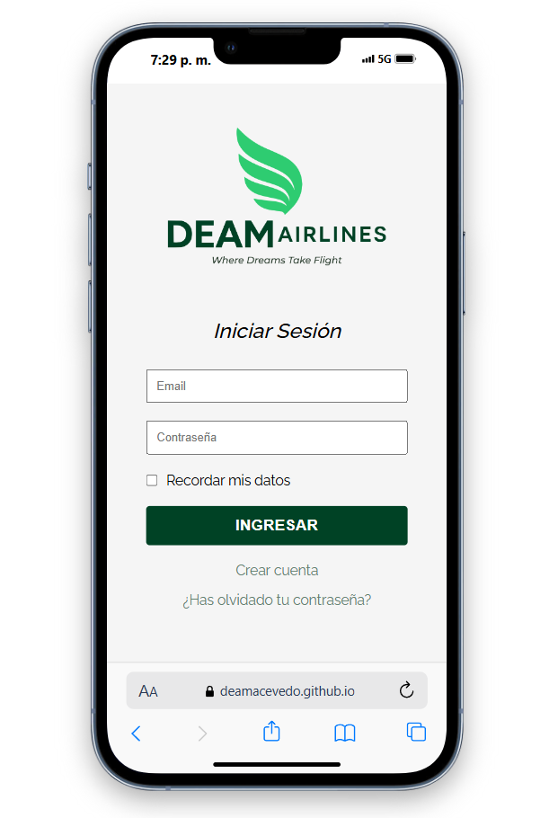

# DEAM AIRLINES APP ✈️

Aplicación web de reservas y gestión de vuelos para usuarios de una aerolínea ficticia llamada **DEAM AIRLINES**.

# 🌐 Demo en línea

Puedes ver el de la aplicacion en GitHub Pages aquí:  
👉 [https://deamacevedo.github.io/Deam-Airlines-APP/](https://deamacevedo.github.io/Deam-Airlines-APP/)  

## 📸 Captura de pantalla



## 📁 Estructura del Proyecto

```
DEAM AIRLINES APP
│
├── font/
│   └── Raleway.ttf                # Fuente personalizada
│
├── icons/                         # Íconos SVG/PNG utilizados en la interfaz
│   ├── AvionVolando.svg
│   ├── menu1.svg, menu2.svg, menu3.svg
│   └── perfil.svg, logos en varias versiones
│
├── styles/
│   └── styles.css                 # Estilos generales de la app
│
├── views/                         # Páginas HTML de la app
│   ├── busqueda-vuelos.html      # Búsqueda de vuelos
│   ├── checkin.html              # Check-In de vuelos
│   ├── crear-contraseña.html     # Creación de contraseña
│   ├── menu.html                 # Menú principal
│   ├── mis-vuelos.html           # Consulta de vuelos del usuario
│   ├── recuperar-contraseña.html# Recuperación de contraseña
│   ├── registro.html             # Registro de nuevos usuarios
│   └── vuelos-disponibles.html  # Muestra vuelos disponibles tras una búsqueda
│
└── index.html                    # Página inicial/login
```

## ✨ Funcionalidades

- Registro e inicio de sesión de usuarios
- Búsqueda de vuelos por origen, destino y fechas
- Visualización de vuelos disponibles
- Check-In digital
- Consulta del historial de vuelos
- Formulario para contacto de emergencia
- Interfaz amigable con íconos visuales e intuitivos

## 🛠️ Tecnologías

- HTML5
- CSS3
- Fuente personalizada: Raleway
- Íconos en formato SVG


## 📸 Vista previa

Incluye interfaz responsiva con tarjetas de vuelos que muestran:
- Icono de avión
- Horarios, duración y fecha
- Código de vuelo, estado (A TIEMPO, ATERRIZÓ) y ruta

## ✅ Estado del proyecto

🚧 En desarrollo / prototipo visual listo para pruebas funcionales.

---

Desarrollado con 💙 por el equipo de DEAM AIRLINES APP
